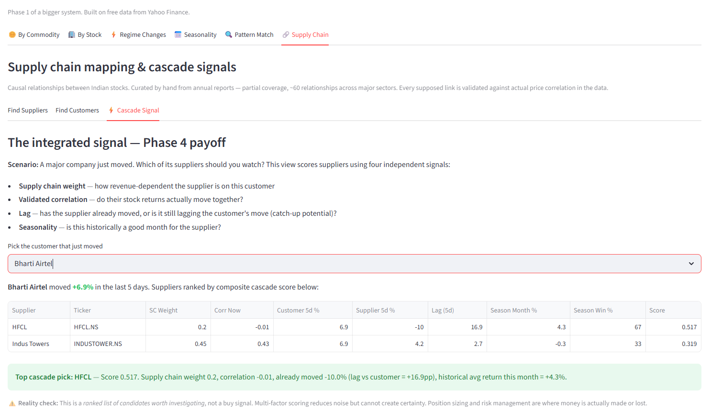

# Commodity ↔ Stock Correlator (India)

A multi-module quantitative analysis system for Indian equities. Six modules covering correlation, seasonality, pattern matching, supply chain mapping, and self-critiquing backtests — all on free data, deployed publicly.

🔗 **Live app:** [commodity-correlator-india.streamlit.app](https://commodity-correlator-india.streamlit.app/)



---

## What it does

**🪙 By Commodity / 🏢 By Stock** — Live correlation rankings between 8 commodities (Gold, Silver, Crude, Copper, Steel, Aluminum, Sugar, Natural Gas) and 73 Indian stocks. Identifies which stocks are most affected by which commodities, and tracks how those relationships shift over time.

**⚡ Regime Changes** — Surfaces stock-commodity pairs whose correlation has changed significantly in the last 30 days. The "something just changed" detector — useful for catching sectoral re-pricing in real time.

**📅 Seasonality** — Historical monthly return patterns by stock and sector, with t-test statistical significance testing. Sector × Month heatmap for at-a-glance reading. Catches things like the April effect in Auto (100% win rate, p=0.004) and IT's February drawdown (20% win rate over 5 years).

**🔍 Pattern Matching (DTW)** — Dynamic Time Warping similarity matching. Finds historical analogues for current chart patterns, current peers across sectors (often revealing cross-sector co-movement), and international leaders whose patterns may precede Indian moves. Reports a dispersion metric to explicitly flag when matches are noisy — honest signal-quality measurement.

**🔗 Supply Chain Mapping** — 60+ hand-curated supplier-customer relationships across Indian sectors, each validated against actual price correlation in the data. The **Cascade Signal** combines supply chain weight, validated correlation, lag, and seasonality into a composite trade-idea score.

**🧪 Backtest Engine** — Runs the cascade signal against historical trigger events with conservative methodology: no look-ahead bias, transaction costs (0.6% round-trip), three benchmarks, automated honest verdict. **Result so far: the cascade signal as currently designed does not show measurable edge across 4000+ trades** — see [OBSERVATIONS.md](./OBSERVATIONS.md). The fact that the system can catch its own failure is the most important feature.

---

## What I learned building this

The most valuable feature isn't any single module. It's the backtest engine telling me my own signal doesn't work — clearly, with 4000+ trades of evidence, with an automated honest verdict generated from preset thresholds.

That's the difference between a tool that looks like it works and a tool you can actually trust. Most "I built a trading algo" projects skip the validation step because the validation is where the comforting story breaks. Including the validation — and *publishing the negative result* — is the point.

The full set of findings from running this system on current Indian market data lives in [OBSERVATIONS.md](./OBSERVATIONS.md).

---

## Stack

Python · pandas · plotly · streamlit · yfinance · dtaidistance (DTW) · scipy

Deployed on Streamlit Community Cloud. Auto-redeploys on push.

---

## Run locally

```bash